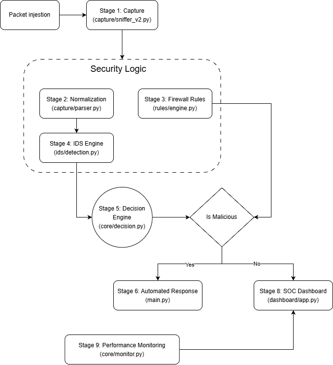

# Next-Generation Firewall + IDS (NGFW)

[](https://www.python.org/)
[]()

A fully functional research-grade Next-Generation Firewall and Intrusion Detection System built entirely from scratch in Python. This project bridges the gap between theoretical network security and enterprise-level execution by implementing a modular architecture designed to detect, log, and mitigate modern threats.

---

## 1️1) Project Overview

### The Problem
Traditional firewalls rely heavily on static rule sets, rendering them blind to complex behavioral attacks and zero-day exploits. Modern networks require intelligent, adaptive defense mechanisms that can recognize malicious traffic patterns rather than just blocking isolated IP addresses.

### Why Firewall + IDS + ML?
Security is most effective in layers. By fusing strict static policy enforcement with stateful behavioral analysis, this system achieves high-fidelity threat detection. Integrating Machine Learning (ML) capabilities in future iterations will transform the firewall from a reactive barrier into a predictive, self-learning defense system.

### Architecture Summary
Inspired by enterprise security processing models like pfSense and Snort, this project utilizes a comprehensive 9-stage pipeline. It covers the entire packet lifecycle: from high-performance Scapy-based live capture to deep packet inspection, automated mitigation, and real-time visualization on a SOC dashboard.



---

## 2️2) Pipeline Architecture

The system's modular design ensures that traffic is processed efficiently through distinct, specialized layers:

* **Stage-1: Packet Ingestion**
    Captures live network traffic using a Scapy-based sniffer. It utilizes a producer-consumer queue to maintain high performance and prevent packet loss during intense traffic spikes.
* **Stage-2: Parsing**
    Focuses on packet normalization. Raw binary data is converted into structured, analysis-ready formats by extracting critical metadata such as IP addresses, ports, protocols, and flags.
* **Stage-3: Detection**
    The core inspection layer splits into two engines. The **Firewall Rule Engine** enforces static, JSON-stored policies to block known bad entities. Simultaneously, the **IDS Engine** performs stateful behavioral analysis to detect complex threats like SYN floods, port scans, and ICMP floods.
* **Stage-4: Response**
    The Decision Engine (the correlation brain) evaluates the outputs from the firewall and IDS to escalate repeat offenders. It triggers an automated response, injecting dynamic rules to blacklist attackers in real-time while logging all forensics for the SOC Dashboard.
* **Stage-5+: ML Integration (Future Scope)**
    The architecture is designed to scale. Future modules will ingest normalized traffic data into Machine Learning models to shift from signature-based detection to predictive threat intelligence and expanded Extended Detection and Response (XDR) capabilities.

---

## 3️3) Installation Instructions

Get the project up and running on your local machine with the following commands:

```bash
git clone [https://github.com/yourusername/n-firewall-ids.git](https://github.com/yourusername/n-firewall-ids.git)
cd n-firewall-ids
pip install -r requirements.txt
python main.py
